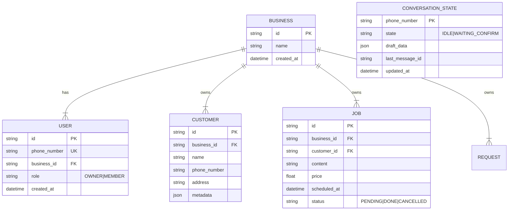

# Data Model: WhatsApp AI CRM

## ER Diagram

## Schema Definitions

### ConversationState

Persistence layer for multi-turn dialogues.

- `state`: ENUM.
  - `IDLE`: Ready for new command.
  - `WAITING_CONFIRM`: Tool call generated, waiting for user YES/NO.
  - `WAITING_CLARIF`: Ambiguity resolution needed.
- `draft_data`: JSON blob storing the proposed Tool Call (e.g., `{"tool": "add_job", "args": {...}}`).

### Business Isolation

Every query MUST filter by `business_id` derived from the `User` making the request.

- `User.business_id` is the source of truth.
