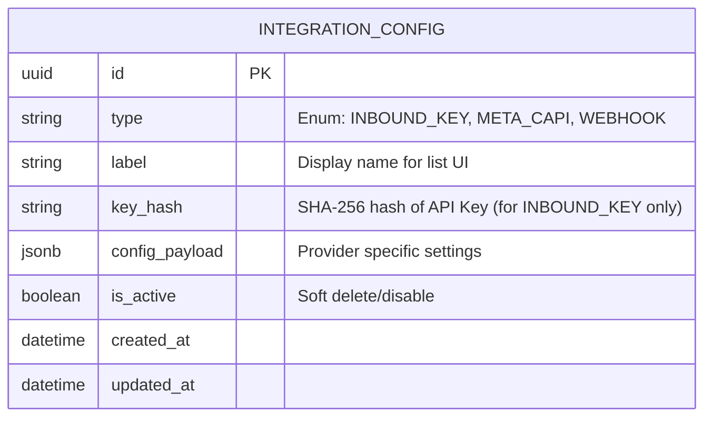

# Data Model: Ad Automation & Integrations

## 1. Schema Changes

### New Table: `integration_configs`

Stores configuration for both inbound API access and outbound event dispatchers.

### Fields Detail

| Field | Type | Description |
|-------|------|-------------|
| `id` | UUID | Primary Key |
| `type` | String | Discriminator: `INBOUND_KEY` (API Access), `META_CAPI` (Outbound), `WEBHOOK` (Outbound) |
| `label` | String | User-friendly name (e.g., "Zapier Key", "Retargeting Pixel") |
| `key_hash` | String | Indexed column for fast lookup. Null for outbound integrations. |
| `config_payload` | JSONB | **INBOUND_KEY**: `{ "permissions": [...] }` **META_CAPI**: `{ "pixel_id": "...", "access_token": "...", "test_code": "..." }` **WEBHOOK**: `{ "url": "...", "signing_secret": "..." }` |
| `is_active` | Boolean | Defaults to `true`. |

## 2. Validation Rules

- **Unique Keys**: `key_hash` must be unique where `type = INBOUND_KEY`.
- **Encryption**: `access_token` and `signing_secret` within `config_payload` should ideally be encrypted at rest, but for this version, we will rely on database-level security and JSON storage.
- **Constraints**:
  - `META_CAPI` config must have `pixel_id` and `access_token`.
  - `WEBHOOK` config must have valid URL.

## 3. Data Flow

### Inbound (Lead Creation)

1. Request arrives with `X-API-Key`.
2. Middleware hashes key -> Lookup `integration_configs` where `key_hash = match` AND `is_active = true`.
3. If found, proceed.

### Outbound (Job Booked)

1. `JobService` emits `job.booked`.
2. Handlers query `integration_configs` for `type IN ('META_CAPI', 'WEBHOOK')` AND `is_active = true`.
3. Dispatcher iterates results and executes payload delivery.
